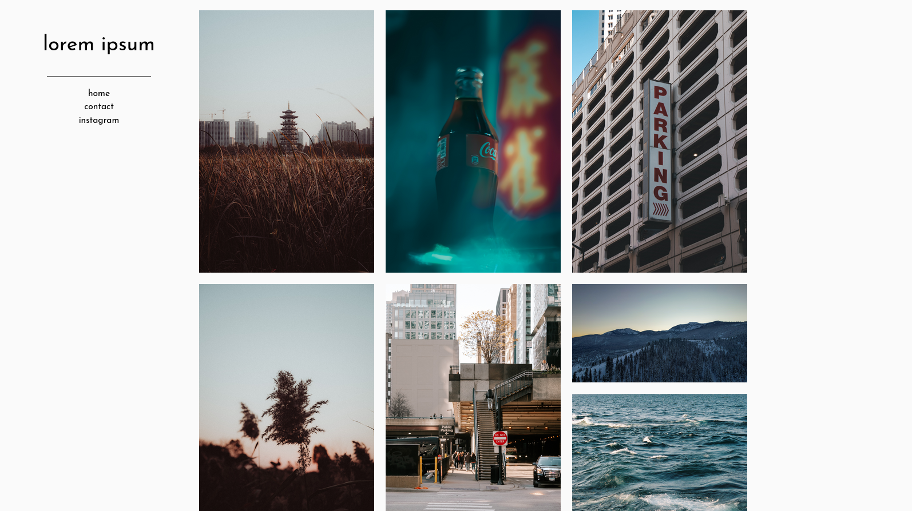
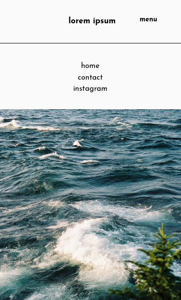

# Hugo Photos
**A simple, responsive photo grid theme for Hugo**

### Screenshots



### Installation
Firstly you need to initialise this repo in the `themes` directory of your hugo site:
```
$ git submodule add https://github.com/jordanwarnes/hugo-photos themes/hugo-photos
```
Then specify `hugo-photos` as your theme by adding the following line in your `config.toml` file
```
theme = "hugo-photos"
```

### Grid usage
To add photos to the grid all you need to do is make a post as usual then specify the image url as the `imgPostUrl property`, for example

```
---
title: "Image Name"
date: 2020-04-02T21:44:26+01:00
draft: false
imgPostUrl: "Your URL Here"
---
```

### Options
Short bio (the text under the site title)
```
[params]
    shortBio = "xyz"
```

### Updating the theme

In the root directory of your Hugo site use the following command:
```
git submodule update --recursive --remote
```

## Attributions

#### Hugo Photo Theme

Based on the Hugo Photo Theme theme by [Tom James Gray](https://github.com/TomJamesGray)

Repository: https://github.com/TomJamesGray/hugo-photo-theme

#### Josefin Sans Font

[Google Fonts](https://github.com/googlefonts)

Repository: https://github.com/googlefonts/josefinsans

License: [OFL-1.1 license](https://github.com/googlefonts/josefinsans/blob/master/OFL.txt)
